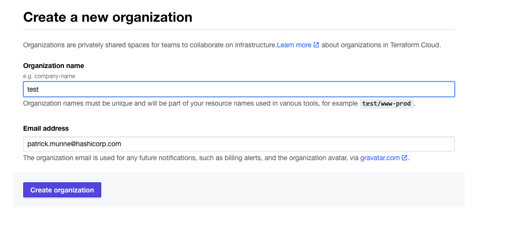
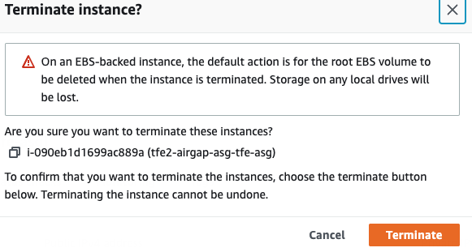
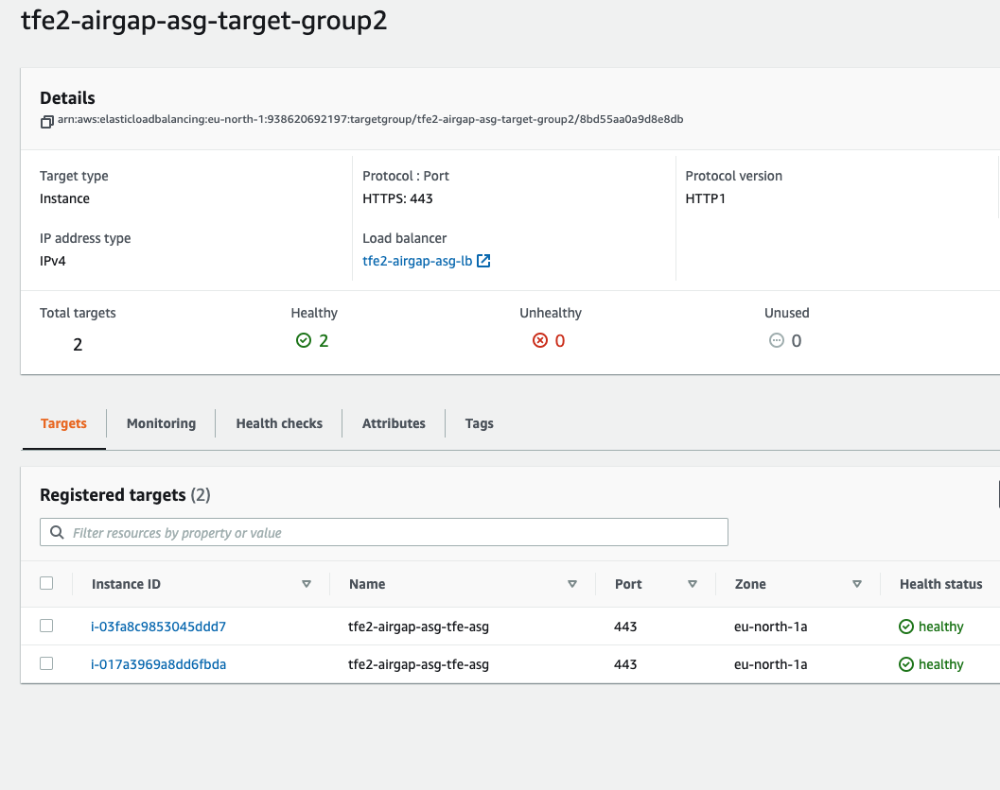
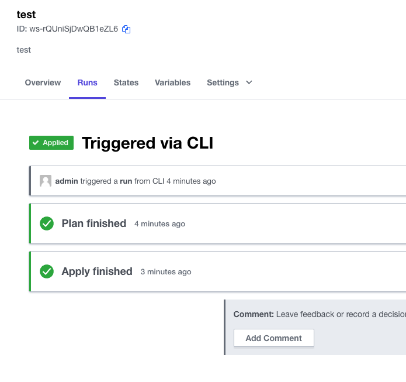

# tfe_aws_active_mode_step
Install Prod External Services ( Redis + S3 + DB ) active-active installation AWS

With this repository you will be able to do a TFE (Terraform Enterprise)active/active online installation on AWS with external services for storage in the form of S3 and PostgreSQL. The server configuration is done by using an autoscaling launch configuration. The TFE instance will be behind a load balancer

The Terraform code will do the following steps

- Create S3 buckets used for TFE
- Upload the necessary software/files for the TFE installation to an S3 bucket
- Generate TLS certificates with Let's Encrypt to be used by TFE
- Create a VPC network with subnets, security groups, internet gateway
- Create a RDS PostgreSQL to be used by TFE
- Create an autoscaling launch configuration which defines the TFE instance installation
- An auto scaling group that points to the launch configuration
- Create an application load balancer for communication to TFE
- Create a Redis database
- Create an autoscaling launch configuration which defines the TFE instance installation active/active
- add a second node


# Diagram

  

# Prerequisites

## License
Make sure you have a TFE license available for use

Store this under the directory `files/license.rli`


## AWS
We will be using AWS. Make sure you have the following
- AWS account  
- Install AWS cli [See documentation](https://docs.aws.amazon.com/cli/latest/userguide/install-cliv2.html)

## Install terraform  
See the following documentation [How to install Terraform](https://learn.hashicorp.com/tutorials/terraform/install-cli)

## TLS certificate
You need to have valid TLS certificates that can be used with the DNS name you will be using to contact the TFE instance.  
  
The repo assumes you have no certificates and want to create them using Let's Encrypt and that your DNS domain is managed under AWS. 

# How to

## Build TFE single instance
- Clone the repository to your local machine
```sh
git clone https://github.com/munnep/tfe_aws_active_mode_step.git
```
- Go to the directory
```sh
cd tfe_aws_active_mode_step
```
- Set your AWS credentials
```sh
export AWS_ACCESS_KEY_ID=
export AWS_SECRET_ACCESS_KEY=
export AWS_SESSION_TOKEN=
```
- Store the files needed for the TFE installation under the `./files` directory, See the notes [here](./files/README.md)
- create a file called `variables.auto.tfvars` with the following contents and your own values
```hcl
tag_prefix               = "patrick-tfe22"                            # TAG prefix for names to easily find your AWS resources
region                   = "eu-west-1"                                # Region to create the environment
vpc_cidr                 = "10.234.0.0/16"                            # subnet mask that can be used 
ami                      = "ami-05147510eb2885c80"                    # AMI of the Ubuntu image  
rds_password             = "Password#1"                               # password used for the RDS environment
release                  = 0                                          # release number. 0 is latest. default to 0
filename_license         = "license.rli"                              # filename of your TFE license
dns_hostname             = "patrick-tfe22"                            # DNS hostname for the TFE
dns_zonename             = "tf-support.hashicorpdemo.com"             # DNS zone name to be used
tfe_password             = "Password#1"                               # TFE password for the dashboard and encryption of the data
certificate_email        = "patrick.munne@hashicorp.com"              # Your email address used by TLS certificate registration
terraform_client_version = "1.1.7"                                    # Terraform version you want to have installed on the client machine
public_key               = "ssh-rsa AAAAB3Nza"                        # The public key for you to connect to the server over SSH
tfe_active_active        = false                                      # TFE instance setup of active/active - false to start with
asg_min_size             = 1                                          # autoscaling group minimal size.
asg_desired_capacity     = 2                                          # autoscaling group desired capacity.
asg_max_size             = 2                                          # autoscaling group maximum size.
```
- Terraform initialize
```sh
terraform init
```
- Terraform plan
```sh
terraform plan
```
- Terraform apply
```sh
terraform apply
```
- Terraform output should create 48 resources and show you the public dns string you can use to connect to the TFE instance
```sh
Apply complete! Resources: 48 added, 0 changed, 0 destroyed.

Outputs:

ssh_tf_client = "ssh ubuntu@patrick-tfe3-client.bg.hashicorp-success.com"
ssh_tfe_server = [
  "ssh -J ubuntu@patrick-tfe3-client.bg.hashicorp-success.com ubuntu@<internal ip address of the TFE server>",
]
tfe_appplication = "https://patrick-tfe3.bg.hashicorp-success.com"
tfe_dashboard = "https://patrick-tfe3.bg.hashicorp-success.com:8800"
tfe_netdata_performance_dashboard = "http://patrick-tfe3.bg.hashicorp-success.com:19999"
```

### Automated setup of TFE account, organization, workspace

- run the following script to do the following  
create a user named: admin (with default password)  
create an organization named: test  
create a workspace named: test-workspace  
```
ssh -J ubuntu@patrick-tfe22-client.tf-support.hashicorpdemo.com ubuntu@10.237.11.21 bash /tmp/tfe_setup.sh
```

### Manual setup of TFE account, organization, workspace
- Connect to the TFE dashboard. This could take 5 minutes before fully functioning.  
See the url for tfe_dashboard in your terraform output. 
- Unlock the dashboard with password from your `variables.auto.tfvars`    
   
- Click on the open button to go to the TFE application page  
    
- Create the first account  

- create your organization and workspaces  
  

- You now have a single TFE instance running

## Continue to make it active/active

- in the `terraform.auto.tfvars` file change the configuration to the active active launch configuration is true

```
tfe_active_active        = true
```
- Run terraform apply

```
terraform apply

Apply complete! Resources: 0 added, 1 changed, 0 destroyed.
```

- Terminate the current instance  
    
- A new instance should be started with an active/active configuration
- You should be able to login and see the workspace again. 
- run terraform apply
```
terraform apply

Apply complete! Resources: 0 added, 1 changed, 0 destroyed.
```
- you should see a second TFE instance coming online  
  
- Eventually these should be healthy under the load balancer target group
    

## testing the active/active environment

- go the directory `test_terraform`
```
cd test_terraform
```
- change the `main.tf` with your own values in the connect string
```
terraform {
  cloud {
    hostname = "patrick-tfe22.tf-support.hashicorpdemo.com"             <-- change this line with your own
    organization = "test"

    workspaces {
      name = "test-workspace"
    }
  }
}
```
- login with terraform

```
terraform login patrick-tfe22.tf-support.hashicorpdemo.com
```
- Run terraform init
```
terraform init
```
- run terraform apply
```
terraform apply
```
- See the result in TFE itself
- If this succeeds you have a working active-active tfe environment  
    


# TODO


# DONE

- [x] create VPC
- [x] create 4 subnets, 2 for public network, 2 for private network
- [x] create internet gw and connect to public network with a route table
- [x] create nat gateway, and connect to private network with a route table
- [x] route table association with the subnets 
- [x] security group for allowing port 443 8800 6379 8201
- [x] Get an Airgap software download
- [x] transfer files to bucket
      - airgap software
      - license
      - Download the installer bootstrapper
- [x] Generate certificates with Let's Encrypt to use
- [x] import TLS certificate
- [x] create a LB (check Application Load Balancer or Network Load Balancer)
- [x] publish a service over LB TFE dashboard and TFE application
- [x] create DNS CNAME for website to loadbalancer DNS
- [x] adding authorized keys 
- [x] RDS PostgreSQL database
- [x] use standard ubuntu image
- [x] install TFE
- [x] swappiness
- [x] disks
- [x] Auto scaling launch configuration
- [x] Auto scaling group creating
- [x] create a REDIS database environment
- [x] rescale for active active
- [x] Test the active active environment is able to run workspaces
- [x] refactor
- [x] make it online / remove airgap

